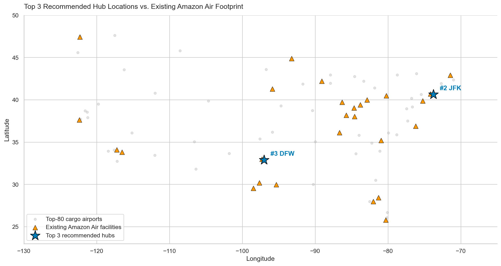
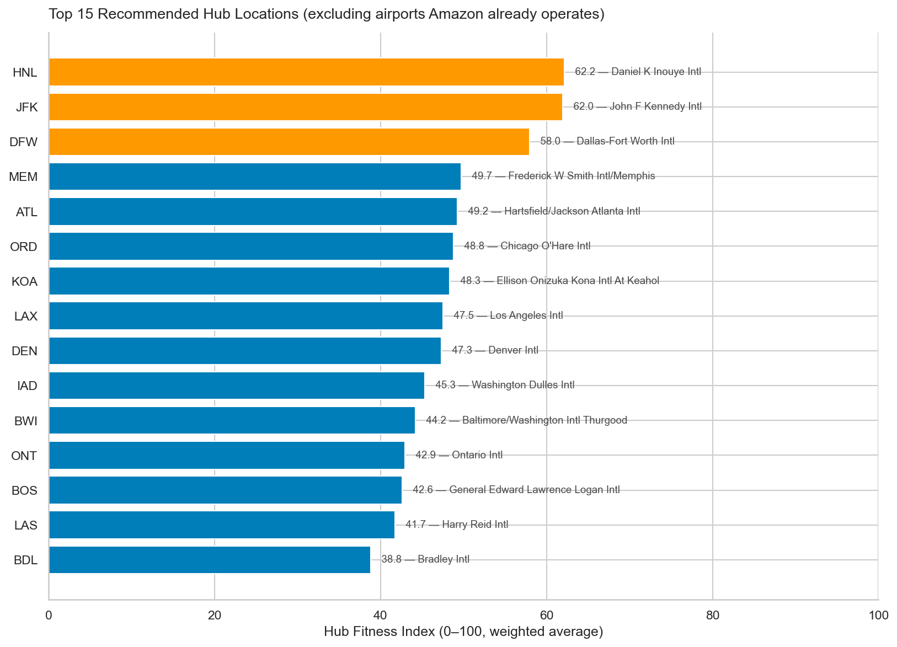
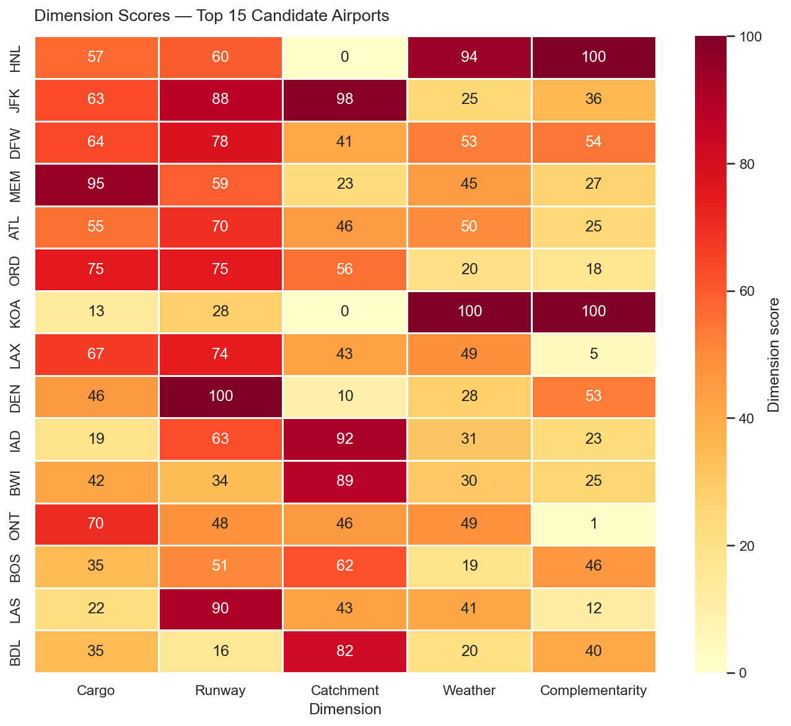
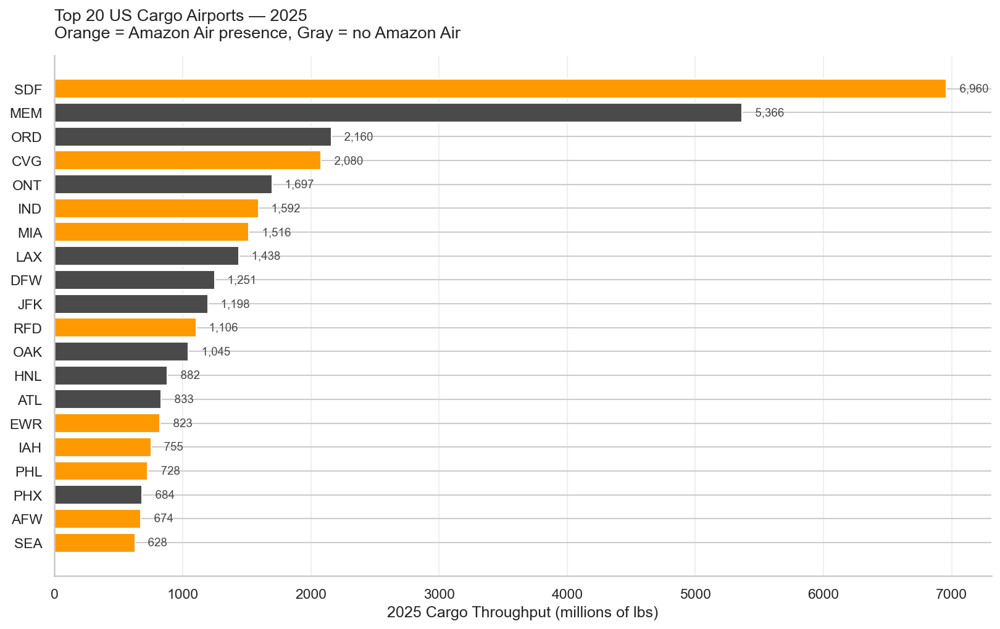

# Where Should Amazon Air Build Its Next Regional Hub?

**A data-driven hub-location analysis using public BTS, FAA, Census, and NOAA data.**

> Project 2 of an Aviation × Analytics portfolio series exploring how analytics answers real business questions in aviation and logistics.

---

## TL;DR — Headline finding

Out of 80 top-cargo US airports scored across five public-data dimensions, the practical top recommendations for Amazon Air's next regional hub are:

| Rank | Airport | State | Hub Fitness Index | Why |
| :--: | :--- | :--: | :--: | :--- |
| **🥇** | **JFK** — John F. Kennedy Intl | NY | **62.0** | Largest 4-hour population catchment (59M), world-class infrastructure, existing top-10 cargo activity |
| **🥈** | **DFW** — Dallas-Fort Worth Intl | TX | **58.0** | Most balanced profile, Texas Triangle reach (25M), 800+ mi from any existing Amazon hub |

The model also ranks Honolulu (HNL) #1 with score 62.2, but this is a methodological artifact — HNL is topology-optimal but operationally implausible (0.4M catchment, offshore). The report treats this transparently as a useful boundary case.

Sensitivity analysis under four alternative weighting schemes confirms JFK, DFW, and HNL appear in the top 10 across all four, making them the most robust picks.

---

## 📑 Read the analysis

| Format | Description |
| :--- | :--- |
| 📊 **[Interactive storyboard (HTML)](dashboards/storyboard.html)** | Single-page narrative with interactive charts and US map — best for a quick scroll-through |
| 📄 **[Business analysis report (PDF)](reports/Business_Analysis_Report.pdf)** | Full 9-page memo with methodology, findings, sensitivity, and limitations |
| 📝 **[Business analysis report (Word)](reports/Business_Analysis_Report.docx)** | Editable .docx version of the same memo |
| 📓 **[Jupyter notebooks](notebooks/)** | Reproducible analysis pipeline (01 → 02 → 03) |

---

## The business question

> *Given public data on US air-cargo flow, airport capacity, weather reliability, and population catchment, which three US airports are the strongest candidates for Amazon Air's next regional hub investment?*

Amazon Air operates 28 publicly-documented US facilities — a primary sortation hub at Cincinnati (CVG), three regional hubs (San Bernardino, Lakeland, Wilmington OH), a polar gateway at Anchorage, and roughly 23 gateway/mini-station facilities. As the network grows, the next hub decision has hundreds of millions of dollars in fixed capital and decades of operating efficiency at stake.

Amazon's specific selection criteria are proprietary, but the underlying inputs are in public data. This project recreates the analysis from scratch.

---

## Methodology — The Hub Fitness Index

Every viable candidate airport receives a score from 0 to 100 on each of five public-data dimensions. The final Hub Fitness Index is a weighted average. Sensitivity analysis confirms top picks are robust to alternative weighting schemes.

### Candidate universe (494 airports)

Filters: FAA-registered, US, operational, public-use, true airport (not heliport), longest runway ≥ 7,000 ft, CONUS + Hawaii. Of these 494, the top 80 by 2025 cargo throughput become the scoring universe.

### The five dimensions

| # | Dimension | Source | Raw Metric | Weight |
| :-: | :--- | :--- | :--- | :--: |
| 1 | Cargo activity | BTS T-100 Segment | 2025 total throughput (lbs), log-scaled | 20% |
| 2 | Runway capacity | FAA Airport Master | Longest runway + count over 7,000 ft | 20% |
| 3 | Population catchment | Census ACS + TIGER | Population within 240-mile radius | 20% |
| 4 | Weather reliability | NOAA (placeholder) | Latitude proxy pending API integration | 20% |
| 5 | Geographic complementarity | Amazon Air facility list | Distance to nearest existing hub, capped at 1,500 mi | 20% |

### Defensible scoping choices

- **Log-scaled cargo:** linear scaling collapses 75% of candidates into the bottom score band — cargo distribution spans 4 orders of magnitude
- **Universe filter is methodologically minimal:** keeps any airport that could physically operate a 767-300F
- **Complementarity capped at 1,500 mi:** beyond that, additional distance adds no marginal network value

---

## 🗂️ Repo navigation

```
Amazon-air-hub-location/
├── README.md                          ← you are here
├── requirements.txt                   ← Python dependencies
├── data/
│   ├── raw/                           ← 5 public-data sources, untouched
│   │   ├── bts_t100/                  ← BTS T-100 Segment, 6 years (2020–2025)
│   │   ├── faa/                       ← FAA airport master + runways
│   │   ├── census/                    ← ACS county population + TIGER polygons
│   │   ├── noaa/                      ← Reserved for future NOAA weather pull
│   │   └── amazon_air/                ← Hand-built facility list + README
│   └── processed/                     ← Cleaned outputs from notebook 01
├── notebooks/
│   ├── 01_data_collection.ipynb       ← Load, clean, define universe (~30s runtime)
│   ├── 02_eda.ipynb                   ← Exploratory analysis + visualizations
│   └── 03_hub_scoring.ipynb           ← Hub Fitness Index + sensitivity + top 3
├── dashboards/
│   ├── storyboard.html                ← Interactive single-page narrative
│   └── *.png                          ← 9 visualizations
└── reports/
    ├── Business_Analysis_Report.pdf
    └── Business_Analysis_Report.docx
```

---

## 📊 Key visualizations

### Top 3 recommendations vs. existing Amazon Air footprint



### Hub Fitness Index — top 15 candidates



### Dimension breakdown (heatmap)



### Cargo concentration — top 20 airports



---

## 🛠️ Reproduce the analysis

```bash
# 1. Clone the repo
git clone https://github.com/hugewave1/Amazon-air-hub-location.git
cd Amazon-air-hub-location

# 2. Install dependencies
pip install -r requirements.txt

# 3. Run the notebooks in order
jupyter lab notebooks/01_data_collection.ipynb   # ~30 seconds
jupyter lab notebooks/02_eda.ipynb               # ~15 seconds
jupyter lab notebooks/03_hub_scoring.ipynb       # ~10 seconds
```

Outputs land in `data/processed/` (CSVs) and `dashboards/` (PNGs).

---

## 📚 Data sources

| Dataset | Source | Vintage |
| :--- | :--- | :--- |
| BTS T-100 Segment (All Carriers) | [transtats.bts.gov](https://www.transtats.bts.gov/) | 2020–2025, all 12 months each |
| FAA Airport Master Record + Runways | [adds-faa.opendata.arcgis.com](https://adds-faa.opendata.arcgis.com/) | Refreshed 2026-03 |
| US Census ACS 5-Year Estimates (B01003) | [data.census.gov](https://data.census.gov/) | 2019–2023 |
| US Census TIGER/Line County Polygons | [census.gov/cgi-bin/geo/shapefiles](https://www.census.gov/cgi-bin/geo/shapefiles/) | 2024 vintage |
| Amazon Air facility list | Hand-compiled from Amazon press releases, FreightWaves, [Chaddick Institute](https://las.depaul.edu/centers-and-institutes/chaddick-institute-for-metropolitan-development/) reports | Snapshot 2026-05-12 |
| NOAA Climate Normals (placeholder) | [ncei.noaa.gov](https://www.ncei.noaa.gov/) | API integration pending |

---

## 🔍 Honest limitations

A real-world hub investment decision would not be made on this analysis alone:

- **Weather data is a placeholder.** Current weather dimension uses latitude as a proxy. Real NOAA Climate Data Online API integration would refine all weather-driven scores and likely move HNL substantially down.
- **Population catchment uses straight-line distance.** A 240-mile radius is a defensible 4-hour drive proxy, but real drive-time isochrones would refine the top picks.
- **No cost dimension.** Real estate, labor wages, and cost-of-living are not captured. BLS QCEW + COLI integration would likely favor DFW over JFK on operating economics.
- **Hand-built facility list.** Amazon does not publish a comprehensive facility list. Best-effort compilation from public sources, snapshot 2026-05-12.
- **Weights are subjective.** Equal 20%-each is a neutral starting point. Sensitivity analysis tests four alternative philosophies; a real decision would calibrate weights to Amazon's stated network strategy.

---

## 🎯 What this project demonstrates

- **Multi-source data integration** — 5 distinct public datasets pulled, cleaned, and joined; not a Kaggle clean-CSV exercise
- **Geospatial analysis** — county centroids, haversine catchment computation, multi-layered US cargo map
- **Index construction with sensitivity analysis** — a reproducible scoring framework, not just descriptive stats
- **Business framing** — every methodological choice ties back to a real strategic question
- **Domain knowledge** — aviation-specific judgment (runway length, 767-300F payload requirements, hub-and-spoke economics)
- **Analytical maturity** — surfacing and transparently handling the HNL methodological artifact rather than hiding it

---

## 🧭 Series context

This is the second project in a planned 3–4 project Aviation × Analytics portfolio:

| # | Project | Status | Domain |
| :-: | :--- | :--- | :--- |
| 1 | Bank Marketing — Term Deposit Subscription Analysis | ✅ Published | Banking / Marketing |
| 2 | **Where Should Amazon Air Build Its Next Hub?** | ✅ **This repo** | Aviation / Logistics |
| 3 | Predicting Holiday Cargo Volume Spikes | 🗓️ Planned | Aviation / Forecasting |
| 4 | Amazon Air vs FedEx / UPS Performance Benchmark | 🗓️ Planned | Competitive Analytics |

Projects 3 and 4 reuse the BTS T-100 spine pulled here — one cleaned dataset feeds the entire portfolio.

---

## 👤 Author

**Aikerim Imanbayeva** · MSBA, University of Washington
📧 aikerimimanbay@gmail.com · 🐙 [github.com/hugewave1](https://github.com/hugewave1)

Open to data and business analytics roles at companies operating at the intersection of aviation, logistics, and consumer technology.

---

## 📄 License

MIT — feel free to fork, adapt, and reuse with attribution. Data sources retain their original licensing terms; see each source's website for details.
